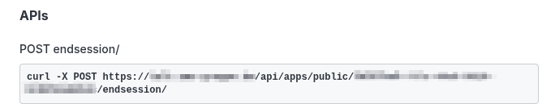

# How to enable the notification for room-closures


## Disclaimer

This is a simple makeshift example how to make your Jitsi's Prosody send an event to Rocket.Chat when a room gets destroyed.  
It is not designed to be a perfect codebase, so feel free to refactor it or write a better one. It just does the job.  

## You require

*   Direct filesystem access to your Jitsi installation (cloud hosted instances will NOT work)
*   Your Rocket.Chat AP hook link.
*   Install the Jitsi-Plugin (this may needed to be done as a private app)
*   Navigate to the Plugin details within your Rocket.Chat apps administrative panel
*   You will find the required link at the BOTTOM of this details page (usually named POST endsession/)
*   A backup of your /etc/prosody folder (better be safe than sorry)





## Installing the makeshift prosody file

This seems slightly different with every linux version.  
The safest way to make the file available to prosody, is by adding it to the folder of your used prosody installation.  

On Debian 13, this folder is for prosody with LUA 5.2:

```plain
/usr/lib/prosody/modules/share/lua/5.2/
```

Remember setting file permissions. Your prosody service user (often: prosody) must own this file and be able to access the folder.  

Now you must alter the site configuration of your prosody site. It is usually located in

```plain
ls /etc/prosody/conf.d/<YOUR JITSI SITE URL>.cfg.lua
```


Find the component named

```plain
Component "conference.<YOUR JITSI SITE URL>" "muc"
```

and add the file to the list of loaded modules

```plain
modules_enabled
```

Do note that you have to do that **WITHOUT** the beginning **mod\_**

```plain
modules_enabled = {
	<YOUR OTHER PLUGIN FILES>;
	"terminate_event";
}
```


## Directing the events towards your Rocket.Chat

Go to your Rocket.Chat apps administrative panel. In the Settings you will find a switch to activate the HTTP endpoint.  
In this section you also have to set a **preshared key**. You will need this soon.  

Edit the mod\_terminate\_event.lua. In the bottom section you find TWO **placeholders** you have to replace.  

1.  Add the URL you have been getting from your Rocket.Chat admin panel (see above)
2.  Add the preshared key you have set in the Plugin settings

```lua
module:log("info", "[Hook] Registering hook for room termination.");
module:hook("muc-room-destroyed", function (event)
module:log("info", "[Hook] Notified of room destruction: %s", event.room);
local payload = {
	['auth'] = '<ADD YOUR PRESHARED KEY HERE>';
['id'] = event.room.jid;
};

async_http_request('<ENTER YOUR ROCKETCHAT HOOK URL HERE (CHECK README.MD FOR DETAILS)>', {
	headers = http_headers;
	method = "POST";
	body = json.encode(payload);
})
end); 
```

## Verifying the installation

Restart your prosody service. If you did everything correctly, the log of prosody will show

```plain
[Hook] Registering hook for room termination.
```

You usually find the log files under /var/log/prosody


## Troubleshooting

**Q: I do not get this hook message in my prosody log.**  
A: Most installations of prosody have a seperated error log, prosody.err. There you can often find messages regarding a failure to load the file, syntax errors or other failures.  
Most of the time this is caused by an incorrect file permission setting. Your prosody service user must own the plugin file to use it.  

**Q: My Rocket.Chat does not recieve the events in question.**  
A: The prosody.log is collecting the return codes of every event sent by this file. That can help you debug the wrong URL path, network problems or other failures.
